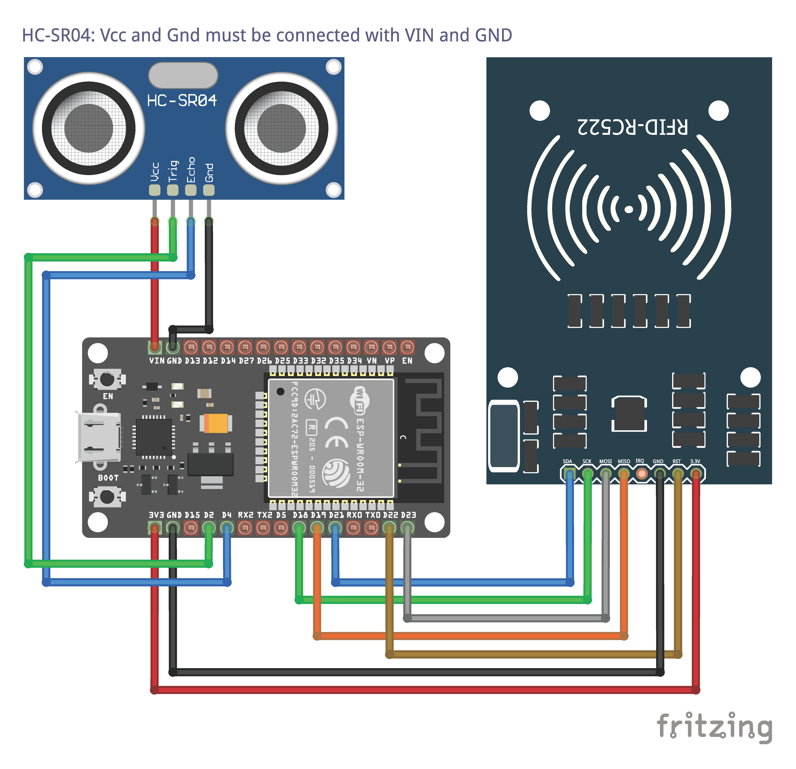

<h1 align="center">

SwiftPay - Microcontroller

</h1>

## Prerequisites

- [Git](https://git-scm.com/) `v2.37+`
- [Arduino IDE](https://www.arduino.cc/en/software) `v1.8.19+`
- Required components:

| Component name                                 | Link(s)                                                                                       |
| ---------------------------------------------- | --------------------------------------------------------------------------------------------- |
| Arduino Uno R3                                 | [Overview of Arduino Uno](https://docs.arduino.cc/hardware/uno-rev3)                          |
| ESP32 WiFi module                              | [ESP32 pinout reference](https://lastminuteengineers.com/esp32-pinout-reference/)             |
| MFRC-522 RFID Module                           | [How MFRC-522 works](https://lastminuteengineers.com/how-rfid-works-rc522-arduino-tutorial/)  |
| SG90 servo motor                               | [How SG90 works](https://lastminuteengineers.com/servo-motor-arduino-tutorial/)               |
| HC-SR04 ultrasonic sensor                      | [How HC-SR04 works](https://lastminuteengineers.com/arduino-sr04-ultrasonic-sensor-tutorial/) |
| Others (e.g., breadboard, wires, battery etc.) |                                                                                               |

## Installations & setup

1. Download or clone the repository

```sh
git clone https://github.com/farhan2077/swiftpay
```

2. Move into the directory

```sh
cd microcontroller/full-module
```

1. Add `secret.h` similar to [secret.h.example](https://github.com/farhan2077/swiftpay/blob/main/microcontroller/full-module/secret.h.example)
2. Install following board and libraries in Arduino IDE

| Board name | Author            | Version | Link(s)                                                                                                                                                         |
| ---------- | ----------------- | ------- | --------------------------------------------------------------------------------------------------------------------------------------------------------------- |
| ESP32      | ESP8266 Community | `2.0.6` | [GitHub](https://github.com/espressif/arduino-esp32) <br /> [Installation process](https://docs.espressif.com/projects/arduino-esp32/en/latest/installing.html) |

| Lirary name | Author                                                   | Version  | Link(s)                                                             |
| ----------- | -------------------------------------------------------- | -------- | ------------------------------------------------------------------- |
| ArduinoJson | Benoît Blanchon                                          | `6.19.4` | [GitHub](https://github.com/bblanchon/ArduinoJson)                  |
| MFRC522     | Miguel André Balboa                                      | `1.4.10` | [GitHub](https://github.com/miguelbalboa/rfid)                      |
| NewPing     | Tim Eckel                                                | `1.9.4`  | [GitHub](https://bitbucket.org/teckel12/arduino-new-ping/wiki/Home) |
| ESP32Servo  | Kevin Harrington                                         | `0.12.1` | [GitHub](https://github.com/madhephaestus/ESP32Servo)               |
| HTTPClient  | _pre-installed, select ESP32 board for automatic import_ |
| WiFi        | _pre-installed_                                          |

5. Connect all components like the following figure

   **NOTES:**

   - Vcc and Gnd of HC-SR04 must be connected with VIN and GND of ESP32

   

6. Steps in Arduino IDE
   1. Select **ESP32 Dev Module** from board manager
   2. Select correct Port
   3. Code burn procedure (must be followed serially)
      1. Press and hold **BOOT** button
      2. Click **EN** button
      3. Click **Upload** button in IDE
      4. Release **BOOT** button when "Connecting..." is displayed in console

**Extra NOTES:**

1. HTTP code references of `HTTPClinet` library [here](https://github.com/espressif/arduino-esp32/blob/master/libraries/HTTPClient/src/HTTPClient.h)
